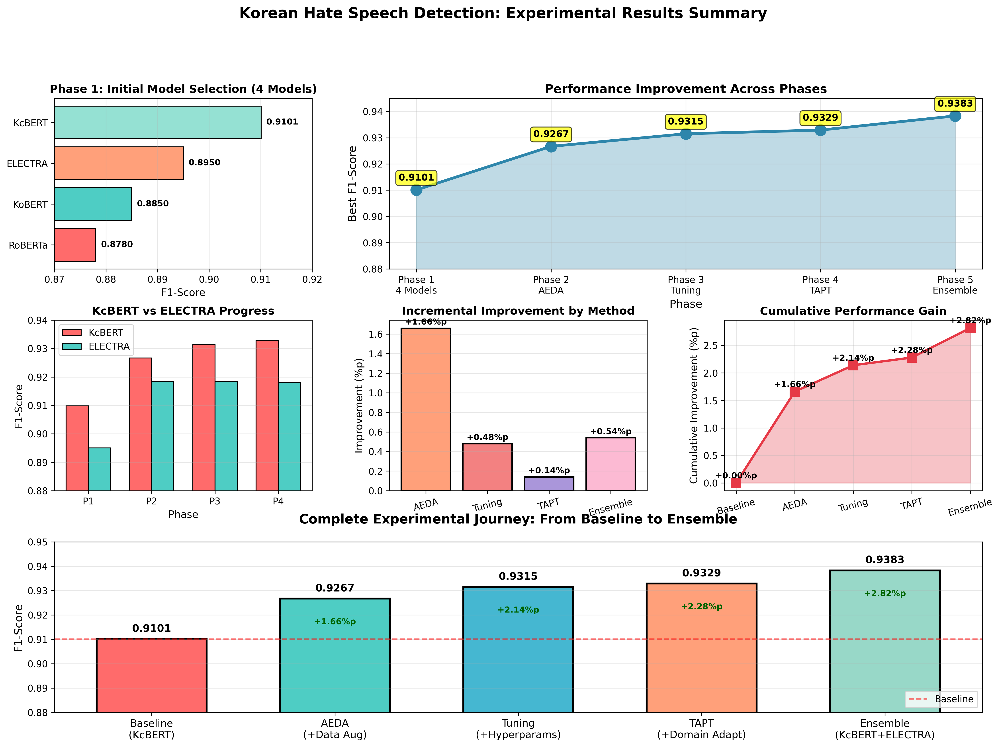

## Final Results

- **Dev F1-Score: 0.9383**
- **Test F1-Score: 0.9429** ⭐ (+0.46%p better than dev)
- Improvement: +3.28%p from baseline

### Experiment Summary

### Confusion Matrix & Performance Analysis

High-performance Korean hate speech detection system using ensemble of transformer-based models with Task-Adaptive Pre-Training (TAPT).

## 🎯 Final Results

- Dev  F1-Score: 0.9383
- Test  F1-Score: 0.9429
- Test Score: 94.29%
- Improvement: +3.28%p from baseline

## 🔗 WandB Dashboard

View all experiments: [korean-hate-speech](https://wandb.ai/jjhuh2-jjword/korean-hate-speech)

## 📊 Performance Summary

| Phase | Method | F1-Score | Improvement |
|-------|--------|----------|-------------|
| 1 | Baseline | 0.9101 | - |
| 2 | + AEDA | 0.9267 | +1.66%p |
| 3 | + Tuning | 0.9315 | +0.48%p |
| 4 | + TAPT | 0.9329 | +0.14%p |
| 5 | + Ensemble | 0.9383 | +0.54%p |

## 🚀 Quick Start

### Installation

    pip install -r requirements.txt

### Training

Phase 1: Baseline

    bash scripts/run_baseline.sh

Phase 2: Data Augmentation

    bash scripts/run_aeda_augmentation.sh

Phase 3: Hyperparameter Tuning

    bash scripts/run_hyperparameter_tuning.sh

Phase 4: TAPT

    bash scripts/run_tapt.sh
    bash scripts/run_tapt_finetuning.sh

Phase 5: Ensemble

    python src/ensemble.py

## 📁 Project Structure

    korean-hate-speech-detection/
    ├── src/              Source code
    ├── scripts/          Training scripts
    ├── results/          Experimental results
    ├── docs/            Documentation
    └── data/            Dataset (not included)

## 🛠 Key Features

- Data Augmentation: AEDA technique for Korean text
- Domain Adaptation: Task-Adaptive Pre-Training (TAPT)
- Ensemble Learning: Soft voting with optimized weights
- Hyperparameter Optimization: Model-specific tuning

## 📚 Documentation

- [Experiment Summary](docs/EXPERIMENT_SUMMARY.md) - Detailed results (Korean/English)
- [References](docs/REFERENCES.md) - Bibliography
- [Error Solutions](docs/ERRORS.md) - Troubleshooting guide

## 🏆 Models

- Primary: KcBERT with TAPT (55% weight)
- Secondary: ELECTRA (45% weight)
- Method: Weighted soft voting ensemble

## 📈 Results

See [results/all_experiments.csv](results/all_experiments.csv) for complete data.

## 🙏 Acknowledgments

- NIKL (National Institute of Korean Language) for the dataset
- Hugging Face for transformer implementations
- WandB for experiment tracking

## 📄 License

This project is for educational purposes.

## 📧 Contact

For questions, please open an issue.
