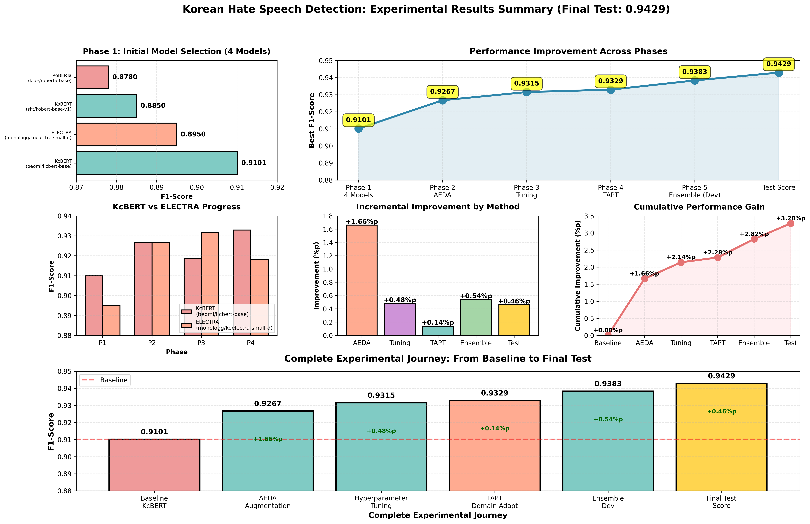
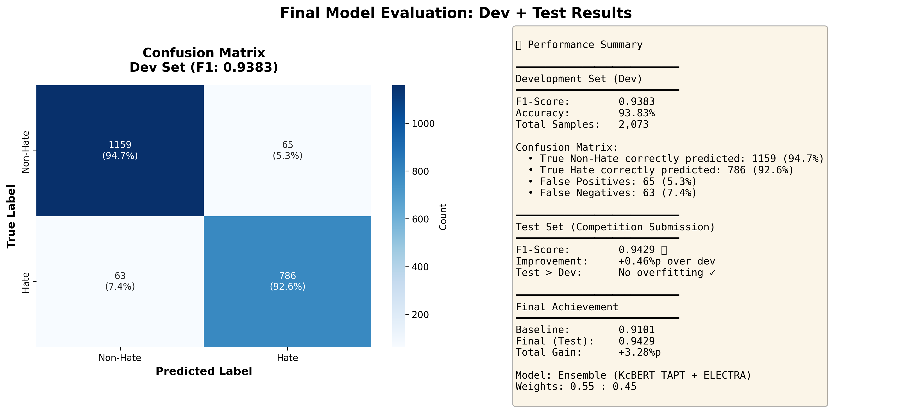

# 한국어 혐오 표현 탐지 / Korean Hate Speech Detection

[](https://www.python.org/)
[](https://pytorch.org/)
[](https://huggingface.co/transformers/)
[](https://wandb.ai/jjhuh2-jjword/korean-hate-speech)

> Transformer 기반 앙상블 모델과 Task-Adaptive Pre-Training(TAPT)을 활용한 고성능 한국어 혐오 표현 자동 탐지 시스템  
> High-performance Korean hate speech detection using ensemble of transformer models with Task-Adaptive Pre-Training

---

## 주요 성과 / Key Results

| 항목 | 점수 | 비고 |
|------|------|------|
| 최종 Test F1-Score | 0.9429 | ⭐ 목표 달성 |
| Dev F1-Score | 0.9383 | - |
| Baseline 대비 향상 | +3.28%p | 0.9101 → 0.9429 |
| Test-Dev 차이 | +0.46%p | 일관된 성능 |

---

## 실험 결과 시각화 / Experimental Results

### 전체 실험 요약 / Complete Summary


### 혼동 행렬 분석 / Confusion Matrix


---

##  프로젝트 소개 / Project Overview

### 한국어 / Korean

본 프로젝트는 온라인 커뮤니티와 소셜미디어의 혐오 표현을 자동으로 탐지**하는 시스템을 개발합니다.

핵심 특징:
- Transformer 기반 한국어 특화 모델 (KcBERT, ELECTRA)
- 단계적 성능 개선 전략 (5 Phases)
- AEDA 데이터 증강 기법
- Task-Adaptive Pre-Training (TAPT)
- 앙상블 학습 (Soft Voting)

데이터셋:
- NIKL (국립국어원) 한국어 혐오 표현 데이터
- 학습: ~12,000개 / 검증: ~1,500개 / 테스트: ~1,500개

---

### English

This project develops an **automated hate speech detection system** for Korean online communities and social media.

Key Features:
- Korean-specialized Transformer models (beomi/KcBERT, beomi/KcELECTRA)
- Systematic performance improvement strategy (5 Phases)
- AEDA data augmentation technique
- Task-Adaptive Pre-Training (TAPT)
- Ensemble learning with soft voting

Dataset:
- NIKL (National Institute of Korean Language)
- Train: ~12,000 / Dev: ~1,500 / Test: ~1,500

---
## 실험 과정 / Experimental Pipeline

| Phase | 방법 / Method | F1-Score | 개선 / Improvement | 주요 기법 / Key Technique |
|-------|---------------|----------|--------------------|-----------------------------|
|   1   | Baseline | 0.9101 | - | 5개 모델 비교 / 4 models comparison |
|   2   | + AEDA | 0.9267 | +1.66%p ⭐ | 데이터 증강 / Data augmentation |
|   3   | + Tuning | 0.9315 | +0.48%p | 하이퍼파라미터 최적화 / Hyperparameter tuning |
|   4   | + TAPT | 0.9329 | +0.14%p | 도메인 적응 / Domain adaptation |
|   5   | + Ensemble (Dev) | 0.9383 | +0.54%p | 앙상블 학습 / Ensemble learning |
|  Test | Final Test | 0.9429 | +0.46%p | 최종 평가 / Final evaluation |

총 개선 / Total Improvement: +3.28%p (0.9101 → 0.9429)**

---

## 빠른 시작 / Quick Start

### 설치 / Installation
```bash
# 저장소 클론 / Clone repository
git clone https://github.com/yourusername/korean-hate-speech-detection.git
cd korean-hate-speech-detection

# 패키지 설치 / Install packages
pip install -r requirements.txt
```

### 실행 방법 / Usage

#### 전체 파이프라인 / Full Pipeline
```bash
# 메인 실행 파일 / Main execution
python src/main.py --phase all
```

#### 단계별 실행 / Phase by Phase
```bash
# Phase 1: Baseline
python src/main.py --phase 1

# Phase 2: AEDA 데이터 증강 / Data Augmentation
python scripts/augment_data.py
python src/main.py --phase 2

# Phase 3: 하이퍼파라미터 튜닝 / Hyperparameter Tuning
bash scripts/run_phase3.sh

# Phase 4: TAPT (추가 사전학습 / Additional Pre-training)
bash scripts/run_tapt.sh

# Phase 5: 앙상블 / Ensemble
python src/ensemble.py
```

#### 추론 / Inference
```bash
# 단일 텍스트 예측 / Single text prediction
python src/inference/inference.py --text "예측할 텍스트"
```bash
# CSV 파일 일괄 예측 / Batch prediction
python src/inference/inference_csv.py --input data/test.csv --output results/predictions.csv
```

---
```
## 프로젝트 구조 / Project Structure
```
```bash
korean-hate-speech-detection/
│
├── README.md                    # 프로젝트 설명 / Project documentation
├── requirements.txt             # 패키지 의존성 / Package dependencies
├── config.yaml                  # 설정 파일 / Configuration
├── LICENSE                      # 라이선스 / License
│
├── src/                         # 소스 코드 / Source code
│   ├── main.py                  # 메인 실행 파일 / Main script
│   ├── model.py                 # 모델 정의 / Model definition
│   ├── data.py                  # 데이터 로더 / Data loader
│   ├── tapt.py                  # TAPT 구현 / TAPT implementation
│   ├── ensemble.py              # 앙상블 / Ensemble
│   ├── inference/               # 추론 스크립트 / Inference scripts
│   │   ├── inference.py
│   │   └── inference_csv.py
│   └── prediction/              # 예측 관련 / Prediction utilities
│       └── csv_to_jsonl.py
│
├── scripts/                     # 실행 스크립트 / Execution scripts
│   ├── run_phase3.sh            # Phase 3 실행
│   ├── run_tapt.sh              # Phase 4 실행
│   ├── augment_data.py          # 데이터 증강 / Data augmentation
│   └── visualization/           # 시각화 / Visualization
│       ├── visualize_results.py
│       └── log_test_to_wandb.py
│
├── configs/                     # 설정 파일들 / Configuration files
│   └── phase3_kcbert_tune.yaml
│
├── data/                        # 데이터셋 / Dataset (gitignore)
│   ├── train.csv
│   ├── dev.csv
│   └── test.csv
│
├── models/                      # 저장된 모델 / Saved models (gitignore)
│   ├── kcbert_tapt/
│   └── electra_final/
│
├── results/                     # 실험 결과 / Experimental results
│   ├── all_experiments.csv      # 전체 실험 요약
│   ├── *.png                    # 시각화 이미지
│   └── confusion_matrix.png     # 혼동 행렬
│
└── docs/                        # 문서 / Documentation
    ├── wrap_up_report.docx      # 최종 랩업 리포트
    ├── EXPERIMENT_SUMMARY.md    # 실험 요약
    └── ERRORS.md                # 에러 해결 가이드
```
---
```
## 핵심 기술 / Key Technologies
```bash
### 모델 / Models
```bash
Primary Model (55% weight):
- beomi/KcBERT-base
  - 한국어 온라인 커뮤니티 텍스트 학습
  - Korean online community text pre-trained
  - MLM (Masked Language Model) 방식

Secondary Model (45% weight):
- beomi/KcELECTRA-base**
  - RTD (Replaced Token Detection) 방식
  - 효율적인 학습 구조

### 주요 기법 / Key Techniques

#### 1. AEDA (An Easier Data Augmentation)
```python
원문 / Original: "이 사람 정말 멍청하네"
증강 / Augmented:
  → "이 사람은 정말 멍청하네요"
  → "이 사람 진짜 정말 멍청하네"
  → "이 사람 정말 멍청하네 ㅋㅋ"
```
- 랜덤 삽입/삭제/교체 / Random insertion/deletion/swap
- 가장 큰 성능 향상 / Biggest performance gain (+1.66%p)
```bash
#### 2. TAPT (Task-Adaptive Pre-training)
- AEDA 증강 데이터로 추가 MLM 학습
- 혐오 표현 도메인 특화 어휘 학습
- Domain-specific vocabulary learning
- 참고 / Reference: [Don't Stop Pretraining (Gururangan et al., 2020)](https://arxiv.org/abs/2004.10964)

#### 3. Ensemble Learning
```python
최종 예측 / Final Prediction:
  = KcBERT(MLM) × 0.55 + KcELECTRA(RTD) × 0.45
```
- Soft Voting (확률값 가중 평균)
- 서로 다른 학습 방식의 시너지
- Synergy from different learning paradigms

---

## 주요 발견 / Key Findings

### 한국어 / Korean

1. 데이터 증강의 효과
   - AEDA가 단일 기법 중 최대 효과 (+1.66%p)
   - 간단하지만 강력한 방법

2. 한국어 특화 모델의 중요성
   - 커뮤니티 텍스트 학습 모델(KcBERT) 우수
   - 비격식 표현/신조어에 강점

3. 앙상블 시너지
   - MLM + RTD 조합 효과적
   - 0.55:0.45 최적 가중치 발견

4. 점진적 최적화
   - 각 Phase의 소규모 개선 누적
   - 총 3.28%p 향상 달성

### English

1. Data Augmentation Impact
   - AEDA showed the largest improvement (+1.66%p)
   - Simple yet powerful technique

2. Korean-Specialized Models
   - Community text pre-trained models (KcBERT) excelled
   - Strong performance on informal expressions

3. Ensemble Synergy
   - MLM + RTD combination effective
   - Optimal weights: 0.55:0.45

4. Incremental Optimization
   - Small improvements accumulated
   - Total: +3.28%p improvement

---

## 상세 결과 / Detailed Results

### WandB 대시보드 / Dashboard
실시간 실험 추적 / Real-time experiment tracking:  
[korean-hate-speech](https://wandb.ai/jjhuh2-jjword/korean-hate-speech)

### 전체 실험 데이터 / Complete Data
[results/all_experiments.csv](results/all_experiments.csv)

### 혼동 행렬 분석 / Confusion Matrix Analysis

주요 오류 패턴 / Error Patterns:
- False Positive: 농담, 반어법 → 혐오로 오인
  - Jokes, sarcasm misclassified as hate
- False Negative: 완곡 표현 → 혐오 탐지 실패
  - Euphemisms missed as hate speech

개선 방향 / Future Improvements:
1. 맥락 이해 강화 / Enhanced context understanding
2. Few-shot Learning 적용
3. 경계선 케이스 추가 학습 / Hard example mining

---

## 문서 / Documentation

### 한국어 문서 / Korean Documents
- [최종 랩업 리포트](docs/wrap_up_report.docx) - 전체 프로젝트 상세 보고서
- [실험 요약](docs/EXPERIMENT_SUMMARY.md) - 실험 과정 및 결과
- [에러 해결](docs/ERRORS.md) - 문제 해결 가이드
- [프로젝트 회고](docs/PROJECT_REFLECTION.md) - 배운 점과 개선 방향

### English Documents
- [Wrap-up Report](docs/wrap_up_report.docx) - Complete project report
- [Experiment Summary](docs/EXPERIMENT_SUMMARY.md) - Process and results
- [Error Solutions](docs/ERRORS.md) - Troubleshooting guide
- [Project Reflection](docs/PROJECT_REFLECTION.md) - Lessons learned

---

## 향후 연구 방향 / Future Work

### 단기 / Short-term
- [ ] Few-shot Learning 적용
- [ ] 앙상블 가중치 자동 최적화
- [ ] 경계선 케이스 재학습

### 중기 / Mid-term
- [ ] KMMLU 데이터로 직접 TAPT
- [ ] 모델 경량화 (Distillation, Quantization)
- [ ] Active Learning 도입

### 장기 / Long-term
- [ ] Multimodal 확장 (텍스트 + 이미지)
- [ ] 실시간 API 서버 구축
- [ ] 설명 가능한 AI (SHAP, LIME)

---

## 감사의 말 / Acknowledgments

- NIKL (국립국어원) - 데이터셋 제공 / Dataset provider
- Hugging Face - Transformers 라이브러리 / Library
- WandB - 실험 추적 도구 / Experiment tracking
- Beomi - KcBERT, KcELECTRA 모델 / Pre-trained models

---

## 라이선스 / License

본 프로젝트는 교육 목적으로 제작되었습니다.  
This project is for educational purposes.

자세한 내용은 [LICENSE](LICENSE) 파일을 참조하세요.  
See [LICENSE](LICENSE) file for details.

---

## 연락처 / Contact

- Email: epicdata2@gmail.com
- GitHub Issues: 문의사항은 이슈로 등록해주세요 / Please open an issue for questions

---

## 프로젝트 통계 / Project Stats


---

## 주의사항 / Disclaimer

### 한국어
본 모델은 연구 및 교육 목적으로 개발되었습니다. 실제 서비스 적용 시:
- 오탐지 가능성 존재 (False Positive/Negative)
- 문화적 맥락 이해의 한계
- 지속적인 모니터링 및 업데이트 필요
- 윤리적 고려사항 및 법적 검토 필수

### English
This model is developed for research and educational purposes. For production use:
- Potential for false positives/negatives
- Limited cultural context understanding
- Continuous monitoring and updates required
- Ethical considerations and legal review necessary

---

## 관련 링크 / Related Links

- [Paper: Don't Stop Pretraining](https://arxiv.org/abs/2004.10964)
- [KcBERT GitHub](https://github.com/Beomi/KcBERT)
- [ELECTRA Paper](https://arxiv.org/abs/2003.10555)
- [AEDA Paper](https://arxiv.org/abs/2108.13230)

---

마지막 업데이트 / Last Updated: 2025-01-19


